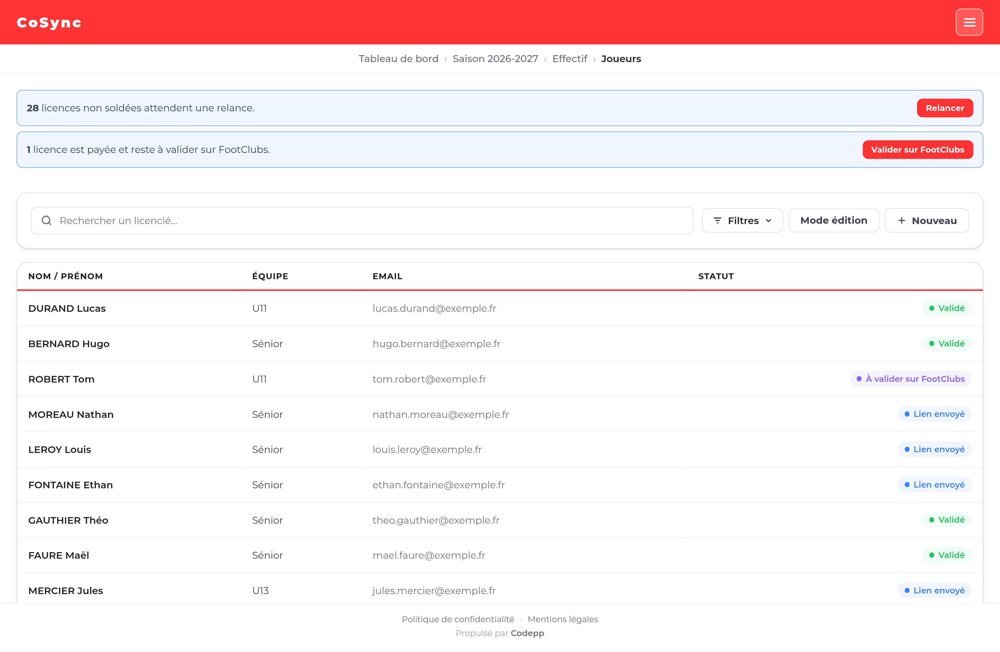
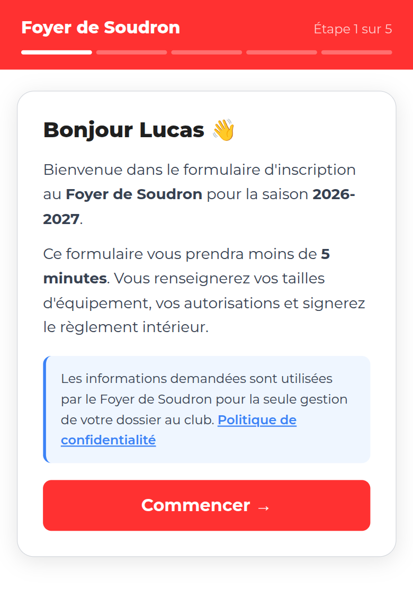
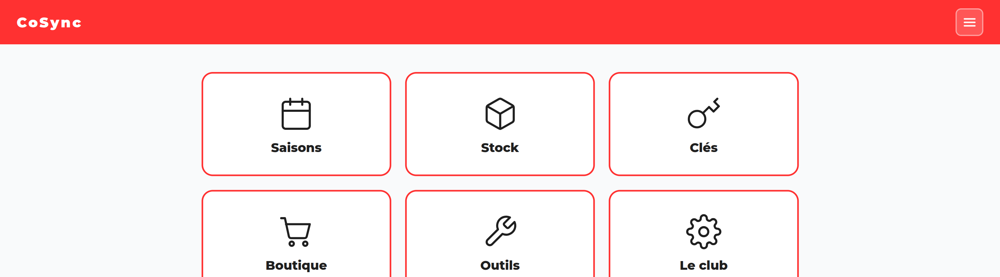
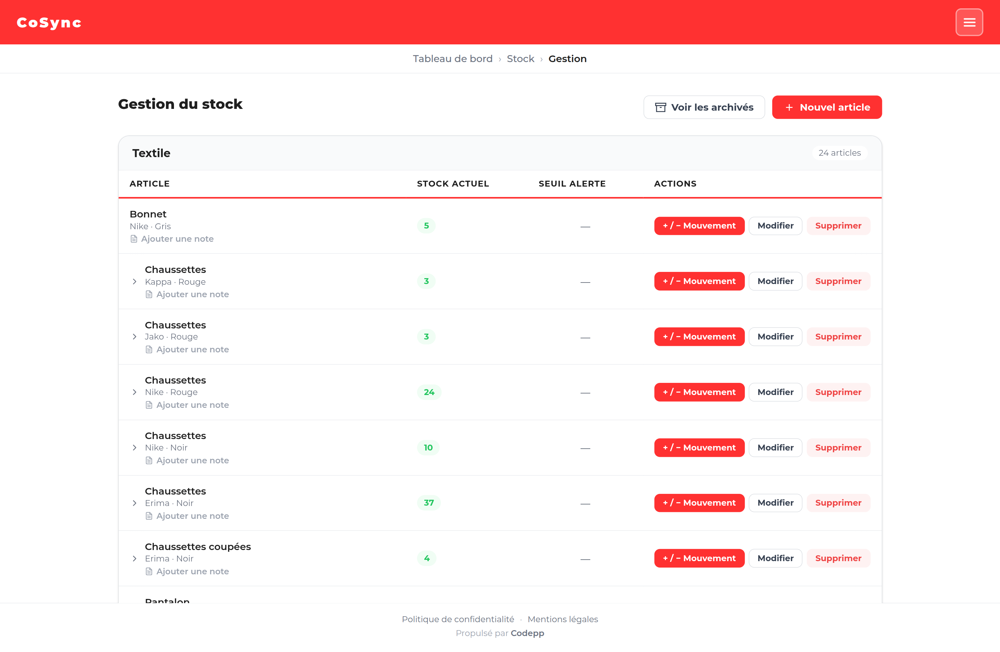
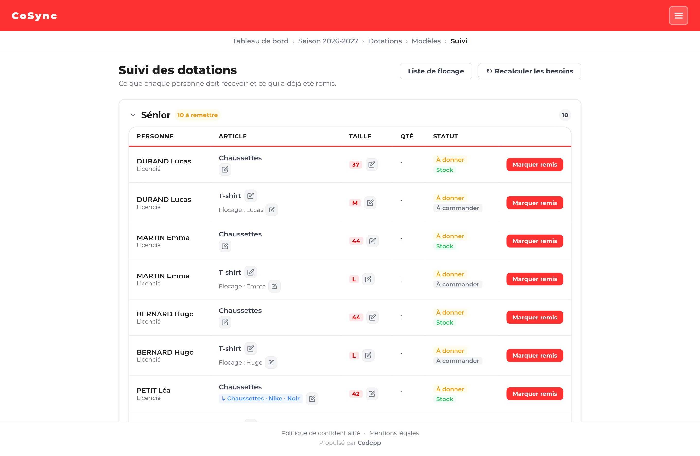
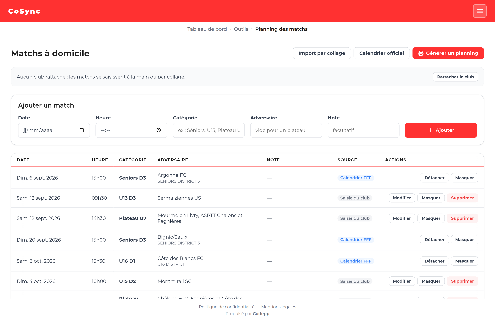

# ⚽ CoSync

**L'application qui fait tourner les coulisses d'un club de football de village.**

CoSync est l'outil de gestion interne du club de football de Soudron, un village de la
Marne. Elle est utilisée **tous les jours, en vraie production**, par les bénévoles qui
font vivre le club — sur leur ordinateur comme sur leur téléphone, au bord du terrain.

---

## L'histoire

Un club de foot amateur, ce sont des dizaines de joueurs — enfants comme adultes — et une
poignée de bénévoles qui gèrent tout le reste : les inscriptions, les cotisations, les
maillots, les papiers à faire signer, les clés du local.

Chaque rentrée de septembre ressemblait à ceci :

- des **fiches papier** distribuées aux familles, remplies à moitié, perdues, redonnées ;
- un **classeur** d'autorisations parentales et de règlements signés ;
- un **tableur** pour pointer qui a payé sa cotisation, mis à jour de mémoire ;
- des **chèques** qui traînent dans une boîte, des relances faites de tête ;
- des cartons de maillots commandés « au jugé », sans savoir ce qui dort déjà au local.

Le logiciel officiel de la Fédération Française de Football gère les licences — le côté
administratif fédéral — mais **rien de tout ça**. CoSync a été créé pour combler ce vide :
un seul outil, pensé pour des bénévoles pressés, qui remplace le papier, le classeur et
le tableur.

## Côté famille : un lien, cinq minutes

Tout commence par un **lien reçu par e-mail**. Pas de compte à créer, pas de mot de passe :
la famille ouvre le lien sur son téléphone et se laisse guider.

En cinq étapes, elle renseigne les **tailles** de maillot, de short et la pointure, coche
les **autorisations** (droit à l'image, transport en voiture par les autres parents),
**signe le règlement du club** au doigt sur l'écran, et choisit comment régler la
cotisation — dont le **paiement par carte en ligne**.

Le document signé devient un PDF, archivé automatiquement dans le dossier en ligne du
club. Personne ne recopie plus rien.

## Côté club : savoir où on en est

L'application s'organise en grands domaines — l'effectif d'une saison, le stock, les clés
du local, la boutique, les outils.

### Qui en est où ?

Pour chaque joueur, un statut clair : lien envoyé, formulaire rempli, cotisation payée,
licence finalisée côté fédération. En haut de l'écran, l'application dit ce qui reste à
faire — ici, 28 relances à envoyer et une licence à valider. Les rappels aux retardataires
partent automatiquement, **jamais deux fois trop vite, et jamais à quelqu'un qui vient de
payer**.

### Qui a payé ?

Les paiements par carte sont vérifiés et rapprochés automatiquement. Un chèque remis au
local se saisit en deux clics. Et quand un employeur ou un comité d'entreprise demande un
justificatif pour rembourser une licence, l'attestation officielle sort en PDF,
pré-remplie.

### Que reste-t-il au local ?

L'inventaire complet du local : ce qui rentre, ce qui sort, ce qui a été donné à qui.

Quand il faut équiper une équipe, l'application croise les tailles déclarées par les
familles avec ce qui reste en stock, et dit pour chaque personne ce qu'elle doit recevoir,
dans quelle taille, avec quel texte à floquer sur le maillot.

Deux détails qui font gagner de l'argent au club : les tailles sont traduites du langage
des familles (« 10 ans ») vers celui du fournisseur (« 140 »), et quand un ancien stock
peut faire l'affaire, l'application le **propose à la place d'un achat neuf** — c'est la
ligne bleue sur la capture ci-dessus.

### Le planning affiché dans le village

Le calendrier des matchs à domicile se synchronise avec celui du district, et se complète
à la main pour ce qui n'y figure pas (les plateaux des plus jeunes, par exemple).

Un clic, et il s'imprime : une version pour la **mairie**, qui planifie la tonte du
terrain, et des **flyers pour les boîtes aux lettres** du village — deux par feuille,
prêts à découper au massicot.

## Ce que ça change

| Avant | Avec CoSync |
|---|---|
| Fiches papier perdues, recopiées à la main | Un lien, cinq minutes sur téléphone |
| « Qui n'a pas payé, déjà ? » | Un statut par joueur, relances automatiques |
| Classeur d'autorisations et de signatures | PDF archivés et classés automatiquement |
| Commandes de maillots au jugé | Stock suivi, anciens cartons écoulés en priorité |
| Planning recopié à la main pour la mairie | Imprimé en trois formats, en un clic |

## Pour les curieux de technique

<b>Déplier la fiche technique</b>

 

| | |
|---|---|
| Framework | Symfony 7 (PHP 8.2, typage strict) |
| Base de données | PostgreSQL + Doctrine |
| Interface | Twig, CSS natif, Alpine.js — pas de SPA, pas d'API REST |
| PDF | DomPDF (règlements signés, attestations, plannings) |
| Intégrations | HelloAsso (paiement en ligne), Google Drive (archivage), API FFF (calendrier), import Excel FootClubs |
| Infra | Docker sur VPS, sauvegardes nocturnes externalisées, tâches planifiées |

Quelques partis pris qui structurent le projet :

- **Toute la logique métier en couche de services**, contrôleurs minces, DTO typés,
  énumérations strictes.
- **Aucune confiance implicite** : un paiement en ligne n'est enregistré qu'après
  revérification auprès de l'API HelloAsso ; aucun e-mail ne part sans décision humaine ;
  chaque envoi laisse une trace dans un journal.
- **Permissions vérifiées par l'intégration continue** : des scripts maison refusent toute
  route d'administration non protégée, et tout bouton menant à un écran auquel le rôle
  connecté n'a pas accès.
- **Mobile d'abord** : l'outil se consulte téléphone en main, au local.
- **La production est sacrée** : les données (signatures manuscrites, encaissements) sont
  irremplaçables. Toute évolution du schéma est relue, testée sur une copie des données
  réelles, et précédée d'une sauvegarde automatique.

## Ce que ce projet raconte

Ce n'est pas une démo : c'est une application **exploitée en production pour de vrais
utilisateurs non techniques**, conçue, développée et opérée en solo depuis mai 2026.

La moitié du travail n'a pas été d'écrire du code, mais de comprendre le fonctionnement
réel d'un club — qui fait quoi, qui oublie quoi, ce qui se perd — et de le traduire en
règles que le logiciel tient à la place des gens : ne jamais relancer quelqu'un qui vient
de payer, ne jamais perdre une signature, ne jamais commander un maillot qui dort déjà
au local.

---

Les captures d'écran proviennent de l'application réelle, avec les données personnelles
remplacées par des identités fictives.
